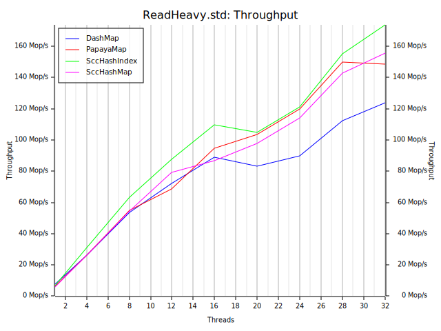
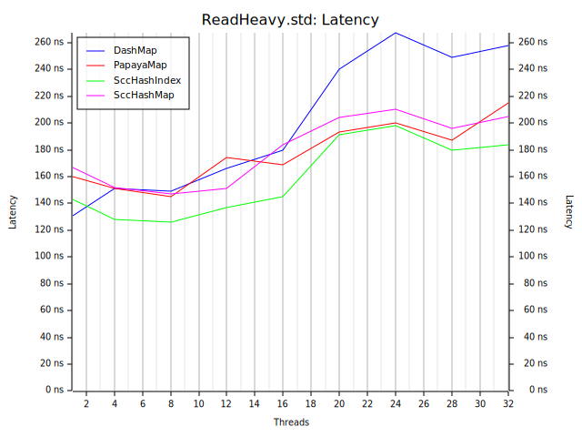
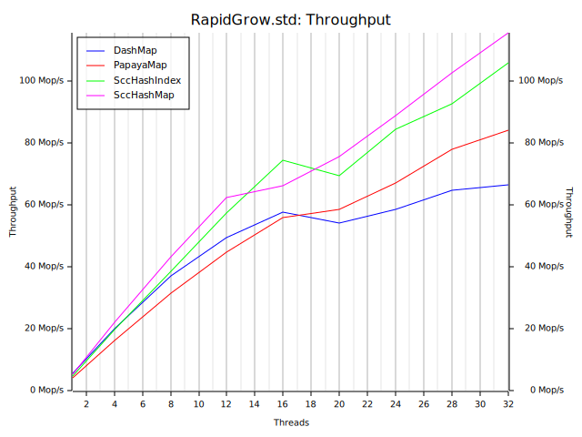

# conc-map-bench

conc-map-bench uses the bustle benchmarking harness. This is a port of the well regarded libcuckoo benchmark.

Implementations benchmarked: DashMap, and `scc::{HashIndex, HashMap}`.

```sh
> cargo tree | rg 'dashmap|scc'
```
```
├── dashmap v5.4.0
├── scc v0.12.1
```

## Workloads

### Read Heavy

A read heavy model with few inserts, removals and updates. Models caching of data in places such as webservers and disk page caches.
```
read   98%
insert  1%
remove  1%
```

### Exchange

Insert and remove heavy model that replicates a scenario where the map is used to exchange data.
```
read    10%
insert  40%
remove  40%
update  10%
```

### Rapid Grow

An insert heavy model that replicates load in a scenario where the map is used to gather large amounts of data under a short burst.
```
read    5%
insert 80%
remove  5%
update 10%
```

## How to Run?

```sh
mv results results.bk
./scripts/bench.bash
./scripts/plot.bash
```

## Results

OS: macOS 13.1.0

CPU: Apple M1

Rust: 1.66.0

See the `results/` directory.

### Read Heavy (fx hasher)
| | |
:-------------------------:|:-------------------------:
 | 

### Exchange (fx hasher)
| | |
:-------------------------:|:-------------------------:
 | 

### Rapid Grow (fx hasher)
| | |
:-------------------------:|:-------------------------:
 | 

### Read Heavy (std hasher)
| | |
:-------------------------:|:-------------------------:
 | 

### Exchange (std hasher)
| | |
:-------------------------:|:-------------------------:
 | 

### Rapid Grow (std hasher)
| | |
:-------------------------:|:-------------------------:
 | 
