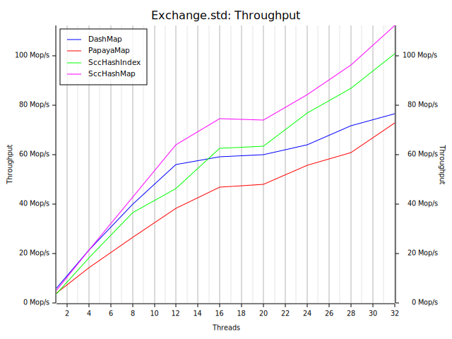
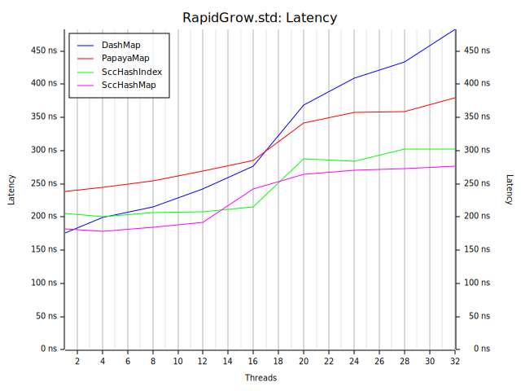
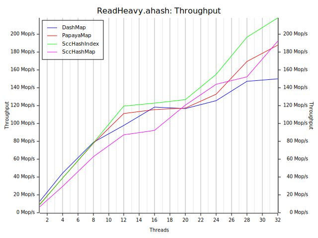
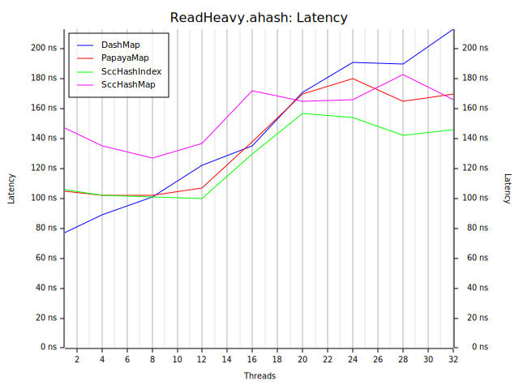
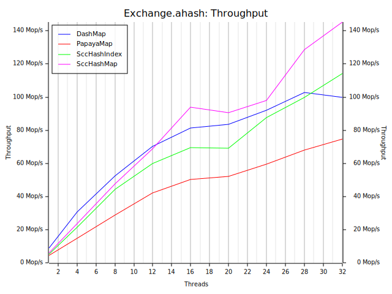
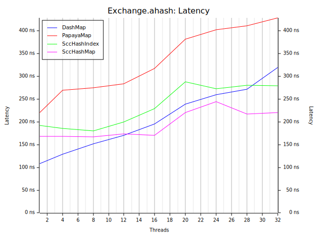
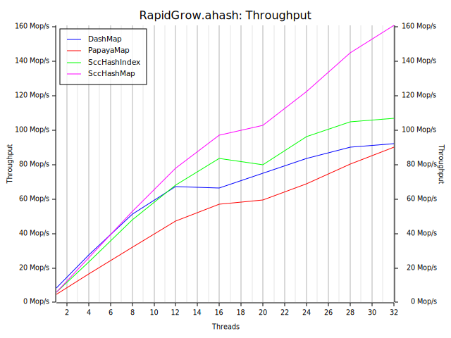
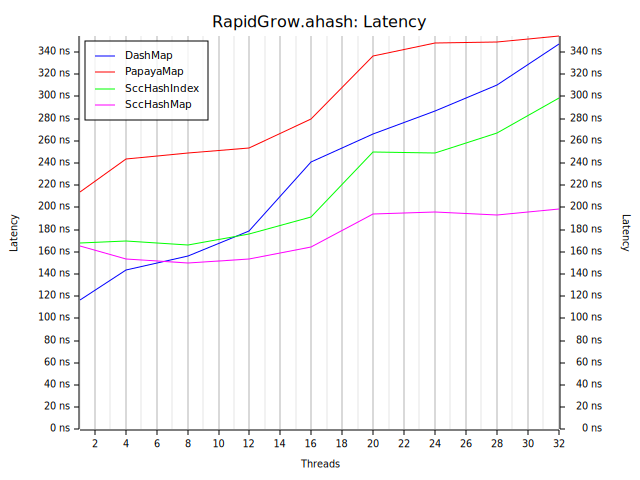

# conc-map-bench

conc-map-bench uses the bustle benchmarking harness. This is a port of the well regarded libcuckoo benchmark.

## Workloads

The benchmark measures performance under varying load conditions. This is done
because a map suitable for one workload may not be suitable for another.

### Read Heavy

A read heavy model with few inserts, removals and updates. Models caching of data in places such as webservers and disk page caches.
```
read   98%
insert  1%
remove  1%
update  0%
```

### Exchange

Insert and remove heavy model that replicates a scenario where the map is used to exchange data.
```
read    10%
insert  40%
remove  40%
update  10%
```

### Rapid Grow

An insert heavy model that replicates load in a scenario where the map is used to gather large amounts of data under a short burst.
```
read    5%
insert 80%
remove  5%
update 10%
```

## How to Run?

```sh
mv results results.bk
./scripts/bench.bash
./scripts/plot.bash
```

## Results

<<<<<<< HEAD
OS: macOS 13.4.1

CPU: Apple M1
=======
Machine: AWS EC2 M7i.8xlarge (Sapphire Rapids 8488C)

OS: Ubuntu Linux 22.04
>>>>>>> 15c1685fd9a2ef3d67b3ed34cdbb33b89c3ba351

Rust: 1.70.0

See the `results/` directory.

<<<<<<< HEAD
### Read Heavy (fx hasher)
| | |
:-------------------------:|:-------------------------:
 | 

### Exchange (fx hasher)
| | |
:-------------------------:|:-------------------------:
 | 

### Rapid Grow (fx hasher)
| | |
:-------------------------:|:-------------------------:
 | 

=======
>>>>>>> 15c1685fd9a2ef3d67b3ed34cdbb33b89c3ba351
### Read Heavy (std hasher)
| | |
:-------------------------:|:-------------------------:
 | 

### Exchange (std hasher)
| | |
:-------------------------:|:-------------------------:
 | 

### Rapid Grow (std hasher)
| | |
:-------------------------:|:-------------------------:
 | 

### Read Heavy (ahash)
| | |
:-------------------------:|:-------------------------:
 | 

### Exchange (ahash)
| | |
:-------------------------:|:-------------------------:
 | 

### Rapid Grow (ahash)
| | |
:-------------------------:|:-------------------------:
 | 
